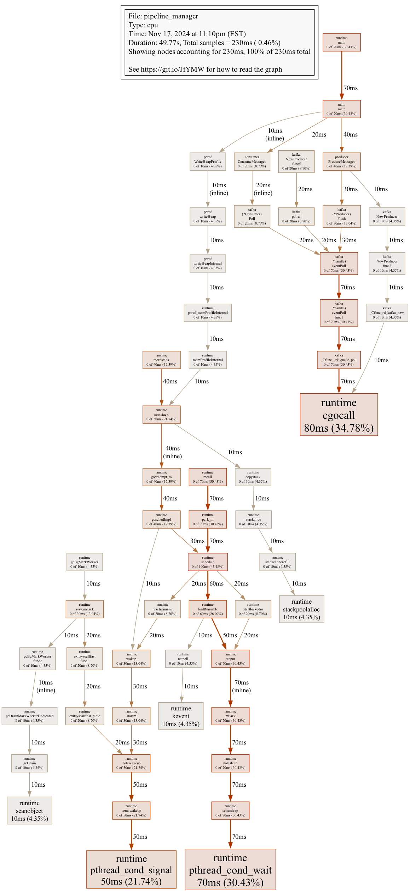
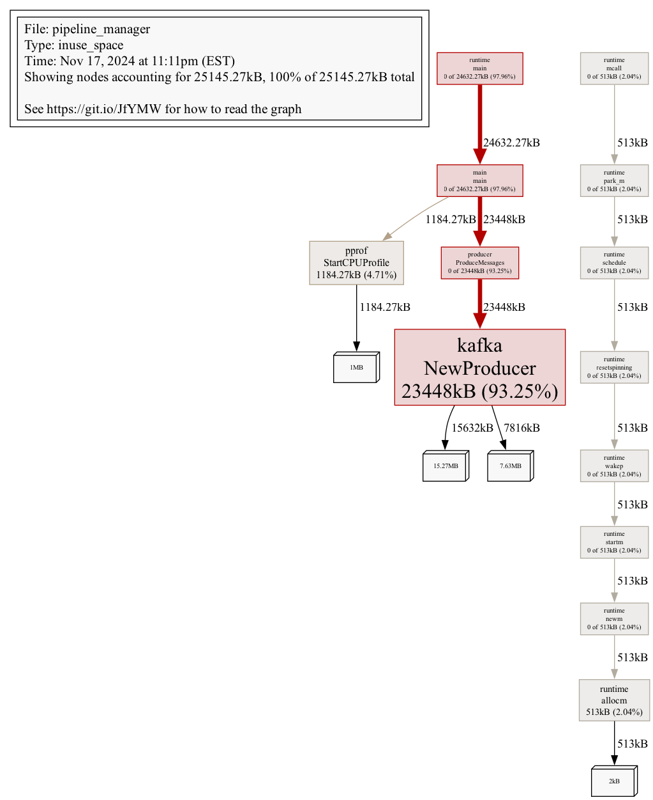

# Project Description
The intent is to build a tool that allows users to create, manage, and monitor data pipelines using a distributed system by integrating it with popular messaging and streaming systems like Kafka and/or Redpanda.

# License
Distributed Data Pipeline Manager is licensed under the MIT License. See the LICENSE file for details.

# Project structure
```bash
distributed-data-pipeline-manager/
├── README.md
├── docker-compose.yml
├── go.mod                    # Module definition
├── go.sum
├── main.go                   # Entry point
├── pipelines/
│   └── benthos/
│       └── sample-pipeline.yaml
├── src/
|   ├── config/
│   │   └── config.go           # Consumer logic
│   ├── consumer/
│   │   └── consumer.go         # Consumer logic
|   ├── execute_pipeline/
│   │   └── execute_pipeline.go # Pipeline Execution logic
│   ├── producer/
│   │   └── producer.go         # Producer logic
├── docs/
└── tests/                      # e2e and integration tests
```

# Setup

## Install rpk (Redpanda CLI Tool)

```bash
brew install redpanda-data/tap/redpanda
```

Specify the broker addresses directly when running an rpk command by using the -X brokers flag. For example:

```bash
rpk cluster info -X brokers=localhost:9092
```

Set the RPK_BROKERS environment variable to define the broker addresses for your session:

```bash
export RPK_BROKERS="localhost:9092"
```

## Test Redpanda Setup

### Set rpk Configuration

```bash
rpk config set redpanda.brokers localhost:9092  
```

### Create a Topic

```bash
rpk topic create test-topic
rpk topic list
```

### Produce and Consume Messages

**Produce Messages**

```bash
rpk topic produce test-topic
```

**Consume Messages**

```bash
rpk topic consume test-topic
```

## Troubleshooting

- If rpk cannot connect to Redpanda, ensure that the docker-compose.yml correctly exposes port 9092 and that the container is running.
- Use the docker logs command to check for errors:

```bash
docker logs <redpanda-container-id>
```

# Profiling

**Prerequisite: `graphviz`**

```bash
brew install graphviz
```

# Running Tests

```bash
make test
```

# Running Pipeline

```bash
make run
Building the application...
mkdir -p bin
cd /dev/sandbox/go/distributed-data-pipeline-manager && go build -o bin/pipeline_manager main.go
Build complete: bin/pipeline_manager
Starting Docker Compose services...
docker compose -f docker-compose.yml up -d
[+] Running 4/4
 ✔ Network distributed-data-pipeline-manager_default       Created                                                                                                           0.0s 
 ✔ Container postgres-container                            Started                                                                                                           0.2s 
 ✔ Container distributed-data-pipeline-manager-redpanda-1  Started                                                                                                           0.2s 
 ✔ Container prometheus-pushgateway                        Started                                                                                                           0.2s 
Running the application...
cd /dev/sandbox/go/distributed-data-pipeline-manager && ./bin/pipeline_manager
2024/11/19 20:14:21 Distributed Data Pipeline Manager
DEBUG: Parsing pipeline configuration...
DEBUG: Parsing pipeline configuration from: pipelines/benthos/sample-pipeline.yaml
DEBUG: Parsed input configuration: {Kafka:{Addresses:[localhost:9092] Topics:[test-topic] ConsumerGroup:test-group}}
DEBUG: Starting producer...
DEBUG: Executing pipeline...
DEBUG: Running pipeline from config: pipelines/benthos/sample-pipeline.yaml
INFO Running main config from specified file       @service=redpanda-connect benthos_version=4.39.0 path=pipelines/benthos/sample-pipeline.yaml
INFO Listening for HTTP requests at: http://0.0.0.0:4195  @service=redpanda-connect
INFO Input type kafka is now active                @service=redpanda-connect label="" path=root.input
DEBU Starting consumer group                       @service=redpanda-connect label="" path=root.input
INFO Output type stdout is now active              @service=redpanda-connect label="" path=root.output.broker.outputs.2
INFO Launching a Redpanda Connect instance, use CTRL+C to close  @service=redpanda-connect
INFO Output type sql_insert is now active          @service=redpanda-connect label="" path=root.output.broker.outputs.0
INFO Output type kafka is now active               @service=redpanda-connect label="" path=root.output.broker.outputs.1
DEBU Consuming messages from topic 'test-topic' partition '0'  @service=redpanda-connect label="" path=root.input
{"data":"TUVTU0FHRSAx","id":"fd705eaa-ca22-4a10-ba6f-4ca14a6fc298","timestamp":"2024-11-19T20:14:22.463069-05:00"}
{"data":"TUVTU0FHRSAw","id":"03121794-55a1-4058-9969-1a4c6356c194","timestamp":"2024-11-19T20:14:22.463065-05:00"}
{"data":"TUVTU0FHRSA4","id":"aa94293b-6987-42b5-9e69-ddcfe6d3a959","timestamp":"2024-11-19T20:14:22.46422-05:00"}
{"data":"TUVTU0FHRSAy","id":"2170587f-49b9-464a-81ec-e3dc30f09142","timestamp":"2024-11-19T20:14:22.463095-05:00"}
{"data":"TUVTU0FHRSAz","id":"97f77299-6436-4054-a545-61f6c475f271","timestamp":"2024-11-19T20:14:22.4631-05:00"}
{"data":"TUVTU0FHRSA5","id":"786ca91b-c6f5-453a-b1fe-b603c21703d2","timestamp":"2024-11-19T20:14:22.464246-05:00"}
{"data":"TUVTU0FHRSA0","id":"a2666f18-6245-47eb-b0c2-9cdb581976d4","timestamp":"2024-11-19T20:14:22.463116-05:00"}
{"data":"TUVTU0FHRSA1","id":"fe74a9c9-ad57-4317-8f0f-2636a6ca62f1","timestamp":"2024-11-19T20:14:22.463137-05:00"}
{"data":"TUVTU0FHRSA2","id":"ab659b78-3fc9-46d3-9385-bdd5935ce597","timestamp":"2024-11-19T20:14:22.463157-05:00"}
{"data":"TUVTU0FHRSA3","id":"02ec20de-d418-4217-aa28-0c6667a34e20","timestamp":"2024-11-19T20:14:22.463163-05:00"}
```

# Stopping

```bash
^CINFO Received SIGINT, the service is closing       @service=redpanda-connect
DEBU Waiting for pending acks to resolve before shutting down.  @service=redpanda-connect label="" path=root.input
DEBU Pending acks resolved.                        @service=redpanda-connect label="" path=root.input
DEBU Waiting for topic consumers to close.         @service=redpanda-connect label="" path=root.input
DEBU Stopped consuming messages from topic 'test-topic' partition '0'  @service=redpanda-connect label="" path=root.input
make: *** [run] Interrupt: 2

DEBU Closing consumer group                        @service=redpanda-connect label="" path=root.input                                                                             
DEBU Topic consumers are closed.                   @service=redpanda-connect label="" path=root.input
```

# Project Reset

**Note:** This will delete all binary and data directories.

```bash
make reset
Cleaning up build artifacts...
rm -rf bin
Binary clean complete.
Stopping and removing all containers...
docker compose -f docker-compose.yml down -v
[+] Running 4/4
 ✔ Container distributed-data-pipeline-manager-redpanda-1  Removed                                                                                                           0.2s 
 ✔ Container prometheus-pushgateway                        Removed                                                                                                           0.1s 
 ✔ Container postgres-container                            Removed                                                                                                           0.1s 
 ✔ Network distributed-data-pipeline-manager_default       Removed                                                                                                           0.1s 
Deleting all Kafka topics...
rpk topic list | awk 'NR>1 {print $1}' | xargs -I {} rpk topic delete {}
unable to request metadata: unable to dial: dial tcp 127.0.0.1:9092: connect: connection refused
Cleaning up data artifacts...
rm -rf postgres-data
rm -rf redpanda-data
Data clean complete.
Project reset complete.

```

**This uses runtime/pprof to programmatically collect profiles and will generate `cpu.pprof` and `mem.pprof` files. Run the following commands to generate visual CPU and Memory graphs.**

```bash
go tool pprof -png ./bin/pipeline_manager cpu.pprof > cpu.png
go tool pprof -png ./bin/pipeline_manager mem.pprof > mem.png
```
## CPU Graph:



## Memory Graph:


